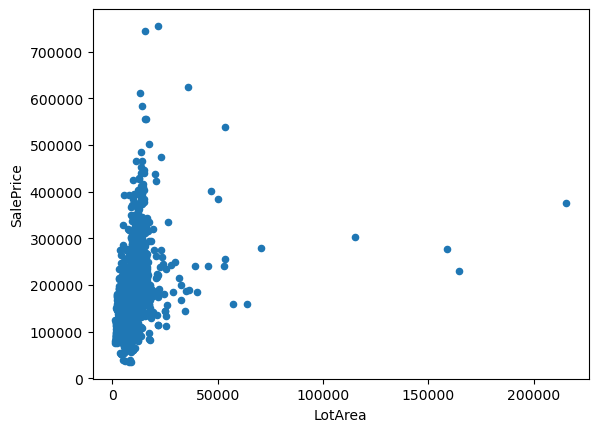
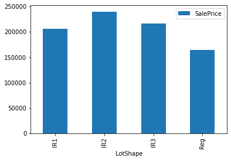
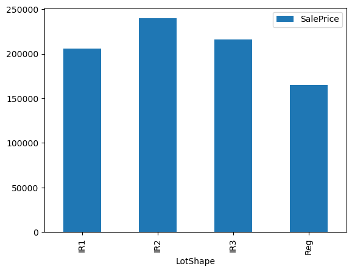
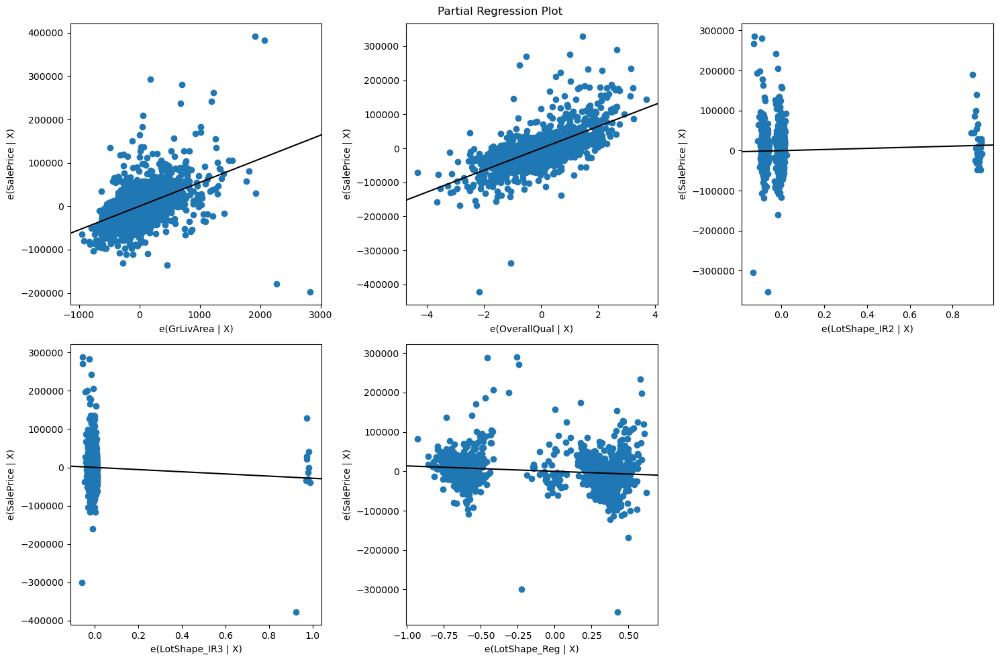

# Dealing with Categorical Variables - Lab


```python

```

## Introduction

In this lab, you'll explore the Ames Housing dataset and identify numeric and categorical variables. Then you'll transform some categorical data and use it in a multiple regression model.

## Objectives

You will be able to:

* Determine whether variables are categorical or numeric
* Use one-hot encoding to create dummy variables

## Step 1: Load the Ames Housing Dataset

Import `pandas`, and use it to load the file `ames.csv` into a dataframe called `ames`. If you pass in the argument `index_col=0` this will set the "Id" feature as the index.


```python
# Your code here - load the dataset

```


```python
# __SOLUTION__ 
# Load the dataset

import pandas as pd
ames = pd.read_csv('ames.csv', index_col=0)
```

Visually inspect `ames` (it's ok if you can't see all of the columns).


```python
# Your code here

```


```python
# __SOLUTION__
ames
```


<div>
<style scoped>
    .dataframe tbody tr th:only-of-type {
        vertical-align: middle;
    }

    .dataframe tbody tr th {
        vertical-align: top;
    }

    .dataframe thead th {
        text-align: right;
    }
</style>
<table border="1" class="dataframe">
  <thead>
    <tr style="text-align: right;">
      <th></th>
      <th>MSSubClass</th>
      <th>MSZoning</th>
      <th>LotFrontage</th>
      <th>LotArea</th>
      <th>Street</th>
      <th>Alley</th>
      <th>LotShape</th>
      <th>LandContour</th>
      <th>Utilities</th>
      <th>LotConfig</th>
      <th>...</th>
      <th>PoolArea</th>
      <th>PoolQC</th>
      <th>Fence</th>
      <th>MiscFeature</th>
      <th>MiscVal</th>
      <th>MoSold</th>
      <th>YrSold</th>
      <th>SaleType</th>
      <th>SaleCondition</th>
      <th>SalePrice</th>
    </tr>
    <tr>
      <th>Id</th>
      <th></th>
      <th></th>
      <th></th>
      <th></th>
      <th></th>
      <th></th>
      <th></th>
      <th></th>
      <th></th>
      <th></th>
      <th></th>
      <th></th>
      <th></th>
      <th></th>
      <th></th>
      <th></th>
      <th></th>
      <th></th>
      <th></th>
      <th></th>
      <th></th>
    </tr>
  </thead>
  <tbody>
    <tr>
      <th>1</th>
      <td>60</td>
      <td>RL</td>
      <td>65.0</td>
      <td>8450</td>
      <td>Pave</td>
      <td>NaN</td>
      <td>Reg</td>
      <td>Lvl</td>
      <td>AllPub</td>
      <td>Inside</td>
      <td>...</td>
      <td>0</td>
      <td>NaN</td>
      <td>NaN</td>
      <td>NaN</td>
      <td>0</td>
      <td>2</td>
      <td>2008</td>
      <td>WD</td>
      <td>Normal</td>
      <td>208500</td>
    </tr>
    <tr>
      <th>2</th>
      <td>20</td>
      <td>RL</td>
      <td>80.0</td>
      <td>9600</td>
      <td>Pave</td>
      <td>NaN</td>
      <td>Reg</td>
      <td>Lvl</td>
      <td>AllPub</td>
      <td>FR2</td>
      <td>...</td>
      <td>0</td>
      <td>NaN</td>
      <td>NaN</td>
      <td>NaN</td>
      <td>0</td>
      <td>5</td>
      <td>2007</td>
      <td>WD</td>
      <td>Normal</td>
      <td>181500</td>
    </tr>
    <tr>
      <th>3</th>
      <td>60</td>
      <td>RL</td>
      <td>68.0</td>
      <td>11250</td>
      <td>Pave</td>
      <td>NaN</td>
      <td>IR1</td>
      <td>Lvl</td>
      <td>AllPub</td>
      <td>Inside</td>
      <td>...</td>
      <td>0</td>
      <td>NaN</td>
      <td>NaN</td>
      <td>NaN</td>
      <td>0</td>
      <td>9</td>
      <td>2008</td>
      <td>WD</td>
      <td>Normal</td>
      <td>223500</td>
    </tr>
    <tr>
      <th>4</th>
      <td>70</td>
      <td>RL</td>
      <td>60.0</td>
      <td>9550</td>
      <td>Pave</td>
      <td>NaN</td>
      <td>IR1</td>
      <td>Lvl</td>
      <td>AllPub</td>
      <td>Corner</td>
      <td>...</td>
      <td>0</td>
      <td>NaN</td>
      <td>NaN</td>
      <td>NaN</td>
      <td>0</td>
      <td>2</td>
      <td>2006</td>
      <td>WD</td>
      <td>Abnorml</td>
      <td>140000</td>
    </tr>
    <tr>
      <th>5</th>
      <td>60</td>
      <td>RL</td>
      <td>84.0</td>
      <td>14260</td>
      <td>Pave</td>
      <td>NaN</td>
      <td>IR1</td>
      <td>Lvl</td>
      <td>AllPub</td>
      <td>FR2</td>
      <td>...</td>
      <td>0</td>
      <td>NaN</td>
      <td>NaN</td>
      <td>NaN</td>
      <td>0</td>
      <td>12</td>
      <td>2008</td>
      <td>WD</td>
      <td>Normal</td>
      <td>250000</td>
    </tr>
    <tr>
      <th>...</th>
      <td>...</td>
      <td>...</td>
      <td>...</td>
      <td>...</td>
      <td>...</td>
      <td>...</td>
      <td>...</td>
      <td>...</td>
      <td>...</td>
      <td>...</td>
      <td>...</td>
      <td>...</td>
      <td>...</td>
      <td>...</td>
      <td>...</td>
      <td>...</td>
      <td>...</td>
      <td>...</td>
      <td>...</td>
      <td>...</td>
      <td>...</td>
    </tr>
    <tr>
      <th>1456</th>
      <td>60</td>
      <td>RL</td>
      <td>62.0</td>
      <td>7917</td>
      <td>Pave</td>
      <td>NaN</td>
      <td>Reg</td>
      <td>Lvl</td>
      <td>AllPub</td>
      <td>Inside</td>
      <td>...</td>
      <td>0</td>
      <td>NaN</td>
      <td>NaN</td>
      <td>NaN</td>
      <td>0</td>
      <td>8</td>
      <td>2007</td>
      <td>WD</td>
      <td>Normal</td>
      <td>175000</td>
    </tr>
    <tr>
      <th>1457</th>
      <td>20</td>
      <td>RL</td>
      <td>85.0</td>
      <td>13175</td>
      <td>Pave</td>
      <td>NaN</td>
      <td>Reg</td>
      <td>Lvl</td>
      <td>AllPub</td>
      <td>Inside</td>
      <td>...</td>
      <td>0</td>
      <td>NaN</td>
      <td>MnPrv</td>
      <td>NaN</td>
      <td>0</td>
      <td>2</td>
      <td>2010</td>
      <td>WD</td>
      <td>Normal</td>
      <td>210000</td>
    </tr>
    <tr>
      <th>1458</th>
      <td>70</td>
      <td>RL</td>
      <td>66.0</td>
      <td>9042</td>
      <td>Pave</td>
      <td>NaN</td>
      <td>Reg</td>
      <td>Lvl</td>
      <td>AllPub</td>
      <td>Inside</td>
      <td>...</td>
      <td>0</td>
      <td>NaN</td>
      <td>GdPrv</td>
      <td>Shed</td>
      <td>2500</td>
      <td>5</td>
      <td>2010</td>
      <td>WD</td>
      <td>Normal</td>
      <td>266500</td>
    </tr>
    <tr>
      <th>1459</th>
      <td>20</td>
      <td>RL</td>
      <td>68.0</td>
      <td>9717</td>
      <td>Pave</td>
      <td>NaN</td>
      <td>Reg</td>
      <td>Lvl</td>
      <td>AllPub</td>
      <td>Inside</td>
      <td>...</td>
      <td>0</td>
      <td>NaN</td>
      <td>NaN</td>
      <td>NaN</td>
      <td>0</td>
      <td>4</td>
      <td>2010</td>
      <td>WD</td>
      <td>Normal</td>
      <td>142125</td>
    </tr>
    <tr>
      <th>1460</th>
      <td>20</td>
      <td>RL</td>
      <td>75.0</td>
      <td>9937</td>
      <td>Pave</td>
      <td>NaN</td>
      <td>Reg</td>
      <td>Lvl</td>
      <td>AllPub</td>
      <td>Inside</td>
      <td>...</td>
      <td>0</td>
      <td>NaN</td>
      <td>NaN</td>
      <td>NaN</td>
      <td>0</td>
      <td>6</td>
      <td>2008</td>
      <td>WD</td>
      <td>Normal</td>
      <td>147500</td>
    </tr>
  </tbody>
</table>
<p>1460 rows × 80 columns</p>
</div>


Go ahead and drop all **columns** with missing data, to simplify the problem. Remember that you can use the `dropna` method ([documentation here](https://pandas.pydata.org/docs/reference/api/pandas.DataFrame.dropna.html)).


```python
# Your code here - drop rows with missing data

```


```python
# __SOLUTION__
ames.dropna(axis=1, inplace=True)
ames
```


<div>
<style scoped>
    .dataframe tbody tr th:only-of-type {
        vertical-align: middle;
    }

    .dataframe tbody tr th {
        vertical-align: top;
    }

    .dataframe thead th {
        text-align: right;
    }
</style>
<table border="1" class="dataframe">
  <thead>
    <tr style="text-align: right;">
      <th></th>
      <th>MSSubClass</th>
      <th>MSZoning</th>
      <th>LotArea</th>
      <th>Street</th>
      <th>LotShape</th>
      <th>LandContour</th>
      <th>Utilities</th>
      <th>LotConfig</th>
      <th>LandSlope</th>
      <th>Neighborhood</th>
      <th>...</th>
      <th>EnclosedPorch</th>
      <th>3SsnPorch</th>
      <th>ScreenPorch</th>
      <th>PoolArea</th>
      <th>MiscVal</th>
      <th>MoSold</th>
      <th>YrSold</th>
      <th>SaleType</th>
      <th>SaleCondition</th>
      <th>SalePrice</th>
    </tr>
    <tr>
      <th>Id</th>
      <th></th>
      <th></th>
      <th></th>
      <th></th>
      <th></th>
      <th></th>
      <th></th>
      <th></th>
      <th></th>
      <th></th>
      <th></th>
      <th></th>
      <th></th>
      <th></th>
      <th></th>
      <th></th>
      <th></th>
      <th></th>
      <th></th>
      <th></th>
      <th></th>
    </tr>
  </thead>
  <tbody>
    <tr>
      <th>1</th>
      <td>60</td>
      <td>RL</td>
      <td>8450</td>
      <td>Pave</td>
      <td>Reg</td>
      <td>Lvl</td>
      <td>AllPub</td>
      <td>Inside</td>
      <td>Gtl</td>
      <td>CollgCr</td>
      <td>...</td>
      <td>0</td>
      <td>0</td>
      <td>0</td>
      <td>0</td>
      <td>0</td>
      <td>2</td>
      <td>2008</td>
      <td>WD</td>
      <td>Normal</td>
      <td>208500</td>
    </tr>
    <tr>
      <th>2</th>
      <td>20</td>
      <td>RL</td>
      <td>9600</td>
      <td>Pave</td>
      <td>Reg</td>
      <td>Lvl</td>
      <td>AllPub</td>
      <td>FR2</td>
      <td>Gtl</td>
      <td>Veenker</td>
      <td>...</td>
      <td>0</td>
      <td>0</td>
      <td>0</td>
      <td>0</td>
      <td>0</td>
      <td>5</td>
      <td>2007</td>
      <td>WD</td>
      <td>Normal</td>
      <td>181500</td>
    </tr>
    <tr>
      <th>3</th>
      <td>60</td>
      <td>RL</td>
      <td>11250</td>
      <td>Pave</td>
      <td>IR1</td>
      <td>Lvl</td>
      <td>AllPub</td>
      <td>Inside</td>
      <td>Gtl</td>
      <td>CollgCr</td>
      <td>...</td>
      <td>0</td>
      <td>0</td>
      <td>0</td>
      <td>0</td>
      <td>0</td>
      <td>9</td>
      <td>2008</td>
      <td>WD</td>
      <td>Normal</td>
      <td>223500</td>
    </tr>
    <tr>
      <th>4</th>
      <td>70</td>
      <td>RL</td>
      <td>9550</td>
      <td>Pave</td>
      <td>IR1</td>
      <td>Lvl</td>
      <td>AllPub</td>
      <td>Corner</td>
      <td>Gtl</td>
      <td>Crawfor</td>
      <td>...</td>
      <td>272</td>
      <td>0</td>
      <td>0</td>
      <td>0</td>
      <td>0</td>
      <td>2</td>
      <td>2006</td>
      <td>WD</td>
      <td>Abnorml</td>
      <td>140000</td>
    </tr>
    <tr>
      <th>5</th>
      <td>60</td>
      <td>RL</td>
      <td>14260</td>
      <td>Pave</td>
      <td>IR1</td>
      <td>Lvl</td>
      <td>AllPub</td>
      <td>FR2</td>
      <td>Gtl</td>
      <td>NoRidge</td>
      <td>...</td>
      <td>0</td>
      <td>0</td>
      <td>0</td>
      <td>0</td>
      <td>0</td>
      <td>12</td>
      <td>2008</td>
      <td>WD</td>
      <td>Normal</td>
      <td>250000</td>
    </tr>
    <tr>
      <th>...</th>
      <td>...</td>
      <td>...</td>
      <td>...</td>
      <td>...</td>
      <td>...</td>
      <td>...</td>
      <td>...</td>
      <td>...</td>
      <td>...</td>
      <td>...</td>
      <td>...</td>
      <td>...</td>
      <td>...</td>
      <td>...</td>
      <td>...</td>
      <td>...</td>
      <td>...</td>
      <td>...</td>
      <td>...</td>
      <td>...</td>
      <td>...</td>
    </tr>
    <tr>
      <th>1456</th>
      <td>60</td>
      <td>RL</td>
      <td>7917</td>
      <td>Pave</td>
      <td>Reg</td>
      <td>Lvl</td>
      <td>AllPub</td>
      <td>Inside</td>
      <td>Gtl</td>
      <td>Gilbert</td>
      <td>...</td>
      <td>0</td>
      <td>0</td>
      <td>0</td>
      <td>0</td>
      <td>0</td>
      <td>8</td>
      <td>2007</td>
      <td>WD</td>
      <td>Normal</td>
      <td>175000</td>
    </tr>
    <tr>
      <th>1457</th>
      <td>20</td>
      <td>RL</td>
      <td>13175</td>
      <td>Pave</td>
      <td>Reg</td>
      <td>Lvl</td>
      <td>AllPub</td>
      <td>Inside</td>
      <td>Gtl</td>
      <td>NWAmes</td>
      <td>...</td>
      <td>0</td>
      <td>0</td>
      <td>0</td>
      <td>0</td>
      <td>0</td>
      <td>2</td>
      <td>2010</td>
      <td>WD</td>
      <td>Normal</td>
      <td>210000</td>
    </tr>
    <tr>
      <th>1458</th>
      <td>70</td>
      <td>RL</td>
      <td>9042</td>
      <td>Pave</td>
      <td>Reg</td>
      <td>Lvl</td>
      <td>AllPub</td>
      <td>Inside</td>
      <td>Gtl</td>
      <td>Crawfor</td>
      <td>...</td>
      <td>0</td>
      <td>0</td>
      <td>0</td>
      <td>0</td>
      <td>2500</td>
      <td>5</td>
      <td>2010</td>
      <td>WD</td>
      <td>Normal</td>
      <td>266500</td>
    </tr>
    <tr>
      <th>1459</th>
      <td>20</td>
      <td>RL</td>
      <td>9717</td>
      <td>Pave</td>
      <td>Reg</td>
      <td>Lvl</td>
      <td>AllPub</td>
      <td>Inside</td>
      <td>Gtl</td>
      <td>NAmes</td>
      <td>...</td>
      <td>112</td>
      <td>0</td>
      <td>0</td>
      <td>0</td>
      <td>0</td>
      <td>4</td>
      <td>2010</td>
      <td>WD</td>
      <td>Normal</td>
      <td>142125</td>
    </tr>
    <tr>
      <th>1460</th>
      <td>20</td>
      <td>RL</td>
      <td>9937</td>
      <td>Pave</td>
      <td>Reg</td>
      <td>Lvl</td>
      <td>AllPub</td>
      <td>Inside</td>
      <td>Gtl</td>
      <td>Edwards</td>
      <td>...</td>
      <td>0</td>
      <td>0</td>
      <td>0</td>
      <td>0</td>
      <td>0</td>
      <td>6</td>
      <td>2008</td>
      <td>WD</td>
      <td>Normal</td>
      <td>147500</td>
    </tr>
  </tbody>
</table>
<p>1460 rows × 61 columns</p>
</div>


## Step 2: Identify Numeric and Categorical Variables

The file `data_description.txt`, located in this repository, has a full description of all variables.

Using this file as well as `pandas` techniques, identify the following predictors:

1. A **continuous numeric** predictor
2. A **discrete numeric** predictor
3. A **string categorical** predictor
4. A **discrete categorical** predictor

(Note that `SalePrice` is the target variable and should not be selected as a predictor.)

For each of these predictors, visualize the relationship between the predictor and `SalePrice` using an appropriate plot.

Finding these will take some digging -- don't be discouraged if they're not immediately obvious! The Ames Housing dataset is a lot more complex than the Auto MPG dataset. There is also no single right answer here.

### Continuous Numeric Predictor


```python
# Your code here - continuous numeric predictor
```


```python
# __SOLUTION__
# A continuous numeric feature should be encoded as some sort of number
ames.select_dtypes("number")
```


<div>
<style scoped>
    .dataframe tbody tr th:only-of-type {
        vertical-align: middle;
    }

    .dataframe tbody tr th {
        vertical-align: top;
    }

    .dataframe thead th {
        text-align: right;
    }
</style>
<table border="1" class="dataframe">
  <thead>
    <tr style="text-align: right;">
      <th></th>
      <th>MSSubClass</th>
      <th>LotArea</th>
      <th>OverallQual</th>
      <th>OverallCond</th>
      <th>YearBuilt</th>
      <th>YearRemodAdd</th>
      <th>BsmtFinSF1</th>
      <th>BsmtFinSF2</th>
      <th>BsmtUnfSF</th>
      <th>TotalBsmtSF</th>
      <th>...</th>
      <th>WoodDeckSF</th>
      <th>OpenPorchSF</th>
      <th>EnclosedPorch</th>
      <th>3SsnPorch</th>
      <th>ScreenPorch</th>
      <th>PoolArea</th>
      <th>MiscVal</th>
      <th>MoSold</th>
      <th>YrSold</th>
      <th>SalePrice</th>
    </tr>
    <tr>
      <th>Id</th>
      <th></th>
      <th></th>
      <th></th>
      <th></th>
      <th></th>
      <th></th>
      <th></th>
      <th></th>
      <th></th>
      <th></th>
      <th></th>
      <th></th>
      <th></th>
      <th></th>
      <th></th>
      <th></th>
      <th></th>
      <th></th>
      <th></th>
      <th></th>
      <th></th>
    </tr>
  </thead>
  <tbody>
    <tr>
      <th>1</th>
      <td>60</td>
      <td>8450</td>
      <td>7</td>
      <td>5</td>
      <td>2003</td>
      <td>2003</td>
      <td>706</td>
      <td>0</td>
      <td>150</td>
      <td>856</td>
      <td>...</td>
      <td>0</td>
      <td>61</td>
      <td>0</td>
      <td>0</td>
      <td>0</td>
      <td>0</td>
      <td>0</td>
      <td>2</td>
      <td>2008</td>
      <td>208500</td>
    </tr>
    <tr>
      <th>2</th>
      <td>20</td>
      <td>9600</td>
      <td>6</td>
      <td>8</td>
      <td>1976</td>
      <td>1976</td>
      <td>978</td>
      <td>0</td>
      <td>284</td>
      <td>1262</td>
      <td>...</td>
      <td>298</td>
      <td>0</td>
      <td>0</td>
      <td>0</td>
      <td>0</td>
      <td>0</td>
      <td>0</td>
      <td>5</td>
      <td>2007</td>
      <td>181500</td>
    </tr>
    <tr>
      <th>3</th>
      <td>60</td>
      <td>11250</td>
      <td>7</td>
      <td>5</td>
      <td>2001</td>
      <td>2002</td>
      <td>486</td>
      <td>0</td>
      <td>434</td>
      <td>920</td>
      <td>...</td>
      <td>0</td>
      <td>42</td>
      <td>0</td>
      <td>0</td>
      <td>0</td>
      <td>0</td>
      <td>0</td>
      <td>9</td>
      <td>2008</td>
      <td>223500</td>
    </tr>
    <tr>
      <th>4</th>
      <td>70</td>
      <td>9550</td>
      <td>7</td>
      <td>5</td>
      <td>1915</td>
      <td>1970</td>
      <td>216</td>
      <td>0</td>
      <td>540</td>
      <td>756</td>
      <td>...</td>
      <td>0</td>
      <td>35</td>
      <td>272</td>
      <td>0</td>
      <td>0</td>
      <td>0</td>
      <td>0</td>
      <td>2</td>
      <td>2006</td>
      <td>140000</td>
    </tr>
    <tr>
      <th>5</th>
      <td>60</td>
      <td>14260</td>
      <td>8</td>
      <td>5</td>
      <td>2000</td>
      <td>2000</td>
      <td>655</td>
      <td>0</td>
      <td>490</td>
      <td>1145</td>
      <td>...</td>
      <td>192</td>
      <td>84</td>
      <td>0</td>
      <td>0</td>
      <td>0</td>
      <td>0</td>
      <td>0</td>
      <td>12</td>
      <td>2008</td>
      <td>250000</td>
    </tr>
    <tr>
      <th>...</th>
      <td>...</td>
      <td>...</td>
      <td>...</td>
      <td>...</td>
      <td>...</td>
      <td>...</td>
      <td>...</td>
      <td>...</td>
      <td>...</td>
      <td>...</td>
      <td>...</td>
      <td>...</td>
      <td>...</td>
      <td>...</td>
      <td>...</td>
      <td>...</td>
      <td>...</td>
      <td>...</td>
      <td>...</td>
      <td>...</td>
      <td>...</td>
    </tr>
    <tr>
      <th>1456</th>
      <td>60</td>
      <td>7917</td>
      <td>6</td>
      <td>5</td>
      <td>1999</td>
      <td>2000</td>
      <td>0</td>
      <td>0</td>
      <td>953</td>
      <td>953</td>
      <td>...</td>
      <td>0</td>
      <td>40</td>
      <td>0</td>
      <td>0</td>
      <td>0</td>
      <td>0</td>
      <td>0</td>
      <td>8</td>
      <td>2007</td>
      <td>175000</td>
    </tr>
    <tr>
      <th>1457</th>
      <td>20</td>
      <td>13175</td>
      <td>6</td>
      <td>6</td>
      <td>1978</td>
      <td>1988</td>
      <td>790</td>
      <td>163</td>
      <td>589</td>
      <td>1542</td>
      <td>...</td>
      <td>349</td>
      <td>0</td>
      <td>0</td>
      <td>0</td>
      <td>0</td>
      <td>0</td>
      <td>0</td>
      <td>2</td>
      <td>2010</td>
      <td>210000</td>
    </tr>
    <tr>
      <th>1458</th>
      <td>70</td>
      <td>9042</td>
      <td>7</td>
      <td>9</td>
      <td>1941</td>
      <td>2006</td>
      <td>275</td>
      <td>0</td>
      <td>877</td>
      <td>1152</td>
      <td>...</td>
      <td>0</td>
      <td>60</td>
      <td>0</td>
      <td>0</td>
      <td>0</td>
      <td>0</td>
      <td>2500</td>
      <td>5</td>
      <td>2010</td>
      <td>266500</td>
    </tr>
    <tr>
      <th>1459</th>
      <td>20</td>
      <td>9717</td>
      <td>5</td>
      <td>6</td>
      <td>1950</td>
      <td>1996</td>
      <td>49</td>
      <td>1029</td>
      <td>0</td>
      <td>1078</td>
      <td>...</td>
      <td>366</td>
      <td>0</td>
      <td>112</td>
      <td>0</td>
      <td>0</td>
      <td>0</td>
      <td>0</td>
      <td>4</td>
      <td>2010</td>
      <td>142125</td>
    </tr>
    <tr>
      <th>1460</th>
      <td>20</td>
      <td>9937</td>
      <td>5</td>
      <td>6</td>
      <td>1965</td>
      <td>1965</td>
      <td>830</td>
      <td>290</td>
      <td>136</td>
      <td>1256</td>
      <td>...</td>
      <td>736</td>
      <td>68</td>
      <td>0</td>
      <td>0</td>
      <td>0</td>
      <td>0</td>
      <td>0</td>
      <td>6</td>
      <td>2008</td>
      <td>147500</td>
    </tr>
  </tbody>
</table>
<p>1460 rows × 34 columns</p>
</div>


```python
# __SOLUTION__
# Just reading from left to right,

# MSSubClass doesn't seem like a good choice, because it seems like it's a
# "code" (i.e. categorical) rather than truly numeric

# LotArea does seem like a reasonable choice. The description says:
# LotArea: Lot size in square feet

# That sounds like a number

ames.plot.scatter(x="LotArea", y="SalePrice");
```


    

    


```python
# __SOLUTION__
# Hmm, that doesn't look quite like a linear relationship. Let's try GrLivArea instead

ames.plot.scatter(x="GrLivArea", y="SalePrice");
```


    

    


```python
# __SOLUTION__
# That looks better. Let's go with that.
```

### Discrete Numeric Predictor


```python
# Your code here - discrete numeric predictor

```


```python
# __SOLUTION__
# Continuing left to right, OverallQual and OverallCond are definitely discrete
import matplotlib.pyplot as plt
fig, (ax1, ax2) = plt.subplots(ncols=2, figsize=(12,5))

ames.plot.scatter(x="OverallQual", y="SalePrice", ax=ax1)
ames.plot.scatter(x="OverallCond", y="SalePrice", ax=ax2);
```


    

    


```python
# __SOLUTION__
# But are they numeric, and linearly related to SalePrice?

# OverallQual looks reasonable. It does seem like a quality of
# 8 is "twice as much" as a quality of 4. Let's call that our
# discrete numeric predictor.
```

### String Categorical Predictor


```python
# Your code here - string categorical predictor

```


```python
# __SOLUTION__
# Now let's select all string columns
ames.select_dtypes("object")
```


<div>
<style scoped>
    .dataframe tbody tr th:only-of-type {
        vertical-align: middle;
    }

    .dataframe tbody tr th {
        vertical-align: top;
    }

    .dataframe thead th {
        text-align: right;
    }
</style>
<table border="1" class="dataframe">
  <thead>
    <tr style="text-align: right;">
      <th></th>
      <th>MSZoning</th>
      <th>Street</th>
      <th>LotShape</th>
      <th>LandContour</th>
      <th>Utilities</th>
      <th>LotConfig</th>
      <th>LandSlope</th>
      <th>Neighborhood</th>
      <th>Condition1</th>
      <th>Condition2</th>
      <th>...</th>
      <th>ExterCond</th>
      <th>Foundation</th>
      <th>Heating</th>
      <th>HeatingQC</th>
      <th>CentralAir</th>
      <th>KitchenQual</th>
      <th>Functional</th>
      <th>PavedDrive</th>
      <th>SaleType</th>
      <th>SaleCondition</th>
    </tr>
    <tr>
      <th>Id</th>
      <th></th>
      <th></th>
      <th></th>
      <th></th>
      <th></th>
      <th></th>
      <th></th>
      <th></th>
      <th></th>
      <th></th>
      <th></th>
      <th></th>
      <th></th>
      <th></th>
      <th></th>
      <th></th>
      <th></th>
      <th></th>
      <th></th>
      <th></th>
      <th></th>
    </tr>
  </thead>
  <tbody>
    <tr>
      <th>1</th>
      <td>RL</td>
      <td>Pave</td>
      <td>Reg</td>
      <td>Lvl</td>
      <td>AllPub</td>
      <td>Inside</td>
      <td>Gtl</td>
      <td>CollgCr</td>
      <td>Norm</td>
      <td>Norm</td>
      <td>...</td>
      <td>TA</td>
      <td>PConc</td>
      <td>GasA</td>
      <td>Ex</td>
      <td>Y</td>
      <td>Gd</td>
      <td>Typ</td>
      <td>Y</td>
      <td>WD</td>
      <td>Normal</td>
    </tr>
    <tr>
      <th>2</th>
      <td>RL</td>
      <td>Pave</td>
      <td>Reg</td>
      <td>Lvl</td>
      <td>AllPub</td>
      <td>FR2</td>
      <td>Gtl</td>
      <td>Veenker</td>
      <td>Feedr</td>
      <td>Norm</td>
      <td>...</td>
      <td>TA</td>
      <td>CBlock</td>
      <td>GasA</td>
      <td>Ex</td>
      <td>Y</td>
      <td>TA</td>
      <td>Typ</td>
      <td>Y</td>
      <td>WD</td>
      <td>Normal</td>
    </tr>
    <tr>
      <th>3</th>
      <td>RL</td>
      <td>Pave</td>
      <td>IR1</td>
      <td>Lvl</td>
      <td>AllPub</td>
      <td>Inside</td>
      <td>Gtl</td>
      <td>CollgCr</td>
      <td>Norm</td>
      <td>Norm</td>
      <td>...</td>
      <td>TA</td>
      <td>PConc</td>
      <td>GasA</td>
      <td>Ex</td>
      <td>Y</td>
      <td>Gd</td>
      <td>Typ</td>
      <td>Y</td>
      <td>WD</td>
      <td>Normal</td>
    </tr>
    <tr>
      <th>4</th>
      <td>RL</td>
      <td>Pave</td>
      <td>IR1</td>
      <td>Lvl</td>
      <td>AllPub</td>
      <td>Corner</td>
      <td>Gtl</td>
      <td>Crawfor</td>
      <td>Norm</td>
      <td>Norm</td>
      <td>...</td>
      <td>TA</td>
      <td>BrkTil</td>
      <td>GasA</td>
      <td>Gd</td>
      <td>Y</td>
      <td>Gd</td>
      <td>Typ</td>
      <td>Y</td>
      <td>WD</td>
      <td>Abnorml</td>
    </tr>
    <tr>
      <th>5</th>
      <td>RL</td>
      <td>Pave</td>
      <td>IR1</td>
      <td>Lvl</td>
      <td>AllPub</td>
      <td>FR2</td>
      <td>Gtl</td>
      <td>NoRidge</td>
      <td>Norm</td>
      <td>Norm</td>
      <td>...</td>
      <td>TA</td>
      <td>PConc</td>
      <td>GasA</td>
      <td>Ex</td>
      <td>Y</td>
      <td>Gd</td>
      <td>Typ</td>
      <td>Y</td>
      <td>WD</td>
      <td>Normal</td>
    </tr>
    <tr>
      <th>...</th>
      <td>...</td>
      <td>...</td>
      <td>...</td>
      <td>...</td>
      <td>...</td>
      <td>...</td>
      <td>...</td>
      <td>...</td>
      <td>...</td>
      <td>...</td>
      <td>...</td>
      <td>...</td>
      <td>...</td>
      <td>...</td>
      <td>...</td>
      <td>...</td>
      <td>...</td>
      <td>...</td>
      <td>...</td>
      <td>...</td>
      <td>...</td>
    </tr>
    <tr>
      <th>1456</th>
      <td>RL</td>
      <td>Pave</td>
      <td>Reg</td>
      <td>Lvl</td>
      <td>AllPub</td>
      <td>Inside</td>
      <td>Gtl</td>
      <td>Gilbert</td>
      <td>Norm</td>
      <td>Norm</td>
      <td>...</td>
      <td>TA</td>
      <td>PConc</td>
      <td>GasA</td>
      <td>Ex</td>
      <td>Y</td>
      <td>TA</td>
      <td>Typ</td>
      <td>Y</td>
      <td>WD</td>
      <td>Normal</td>
    </tr>
    <tr>
      <th>1457</th>
      <td>RL</td>
      <td>Pave</td>
      <td>Reg</td>
      <td>Lvl</td>
      <td>AllPub</td>
      <td>Inside</td>
      <td>Gtl</td>
      <td>NWAmes</td>
      <td>Norm</td>
      <td>Norm</td>
      <td>...</td>
      <td>TA</td>
      <td>CBlock</td>
      <td>GasA</td>
      <td>TA</td>
      <td>Y</td>
      <td>TA</td>
      <td>Min1</td>
      <td>Y</td>
      <td>WD</td>
      <td>Normal</td>
    </tr>
    <tr>
      <th>1458</th>
      <td>RL</td>
      <td>Pave</td>
      <td>Reg</td>
      <td>Lvl</td>
      <td>AllPub</td>
      <td>Inside</td>
      <td>Gtl</td>
      <td>Crawfor</td>
      <td>Norm</td>
      <td>Norm</td>
      <td>...</td>
      <td>Gd</td>
      <td>Stone</td>
      <td>GasA</td>
      <td>Ex</td>
      <td>Y</td>
      <td>Gd</td>
      <td>Typ</td>
      <td>Y</td>
      <td>WD</td>
      <td>Normal</td>
    </tr>
    <tr>
      <th>1459</th>
      <td>RL</td>
      <td>Pave</td>
      <td>Reg</td>
      <td>Lvl</td>
      <td>AllPub</td>
      <td>Inside</td>
      <td>Gtl</td>
      <td>NAmes</td>
      <td>Norm</td>
      <td>Norm</td>
      <td>...</td>
      <td>TA</td>
      <td>CBlock</td>
      <td>GasA</td>
      <td>Gd</td>
      <td>Y</td>
      <td>Gd</td>
      <td>Typ</td>
      <td>Y</td>
      <td>WD</td>
      <td>Normal</td>
    </tr>
    <tr>
      <th>1460</th>
      <td>RL</td>
      <td>Pave</td>
      <td>Reg</td>
      <td>Lvl</td>
      <td>AllPub</td>
      <td>Inside</td>
      <td>Gtl</td>
      <td>Edwards</td>
      <td>Norm</td>
      <td>Norm</td>
      <td>...</td>
      <td>TA</td>
      <td>CBlock</td>
      <td>GasA</td>
      <td>Gd</td>
      <td>Y</td>
      <td>TA</td>
      <td>Typ</td>
      <td>Y</td>
      <td>WD</td>
      <td>Normal</td>
    </tr>
  </tbody>
</table>
<p>1460 rows × 27 columns</p>
</div>


```python
# __SOLUTION__
# That is still a lot of options. What if we look for options where there are
# only a few different unique categories?
ames.select_dtypes("object").nunique().sort_values()
```


    Street            2
    Utilities         2
    CentralAir        2
    LandSlope         3
    PavedDrive        3
    LotShape          4
    LandContour       4
    KitchenQual       4
    ExterQual         4
    MSZoning          5
    LotConfig         5
    BldgType          5
    HeatingQC         5
    ExterCond         5
    Heating           6
    Foundation        6
    SaleCondition     6
    RoofStyle         6
    Functional        7
    HouseStyle        8
    Condition2        8
    RoofMatl          8
    SaleType          9
    Condition1        9
    Exterior1st      15
    Exterior2nd      16
    Neighborhood     25
    dtype: int64


```python
# __SOLUTION__
# LotShape looks good, since there's a good amount of homes in
# multiple categories
ames["LotShape"].value_counts()
```


    LotShape
    Reg    925
    IR1    484
    IR2     41
    IR3     10
    Name: count, dtype: int64


```python
# __SOLUTION__
# Let's plot LotShape
ames.groupby('LotShape').mean('LotShape').sort_index().plot.bar(y='SalePrice');
```


    

    


```python
# __SOLUTION__
# That looks like a good categorical predictor. Even though
# some of the values have numbers in them, they don't seem to
# be linearly related
```

### Discrete Categorical Predictor


```python
# Your code here - discrete categorical predictor

```


```python
# __SOLUTION__
# Let's do the same process of looking for the number of unique
# values, except for numeric columns
ames.select_dtypes("number").nunique().sort_values()
```


    HalfBath            3
    BsmtHalfBath        3
    FullBath            4
    Fireplaces          4
    KitchenAbvGr        4
    BsmtFullBath        4
    GarageCars          5
    YrSold              5
    PoolArea            8
    BedroomAbvGr        8
    OverallCond         9
    OverallQual        10
    MoSold             12
    TotRmsAbvGrd       12
    MSSubClass         15
    3SsnPorch          20
    MiscVal            21
    LowQualFinSF       24
    YearRemodAdd       61
    ScreenPorch        76
    YearBuilt         112
    EnclosedPorch     120
    BsmtFinSF2        144
    OpenPorchSF       202
    WoodDeckSF        274
    2ndFlrSF          417
    GarageArea        441
    BsmtFinSF1        637
    SalePrice         663
    TotalBsmtSF       721
    1stFlrSF          753
    BsmtUnfSF         780
    GrLivArea         861
    LotArea          1073
    dtype: int64


```python
# __SOLUTION__
# Hmm, most of those with relatively few categories look like they are actually numeric

# Let's actually go back to earlier, when we said that MSSubClass and OverallCond were
# not numeric

fig, (ax1, ax2) = plt.subplots(ncols=2, figsize=(12,5))

ames.groupby('MSSubClass').mean('MSSubClass').plot.bar(y='SalePrice', ax=ax1)
ames.groupby('OverallCond').mean('OverallCond').plot.bar(y='SalePrice', ax=ax2);
```


    

    


```python
# __SOLUTION__
# MSSubClass looks least like it could be used as a numeric predictor, so
# let's go with that
```

## Step 3: Build a Multiple Regression Model with Your Chosen Predictors

Choose the best-looking 3 out of 4 predictors to include in your model.

Make sure that you one-hot encode your categorical predictor(s) (regardless of whether the current data type is a string or number) first!


```python
# Your code here - prepare X and y, including one-hot encoding

```


```python
# __SOLUTION__
# MSSubClass is messiest, so exclude that
y = ames["SalePrice"]
X = ames[["GrLivArea", "OverallQual", "LotShape"]]
X
```


<div>
<style scoped>
    .dataframe tbody tr th:only-of-type {
        vertical-align: middle;
    }

    .dataframe tbody tr th {
        vertical-align: top;
    }

    .dataframe thead th {
        text-align: right;
    }
</style>
<table border="1" class="dataframe">
  <thead>
    <tr style="text-align: right;">
      <th></th>
      <th>GrLivArea</th>
      <th>OverallQual</th>
      <th>LotShape</th>
    </tr>
    <tr>
      <th>Id</th>
      <th></th>
      <th></th>
      <th></th>
    </tr>
  </thead>
  <tbody>
    <tr>
      <th>1</th>
      <td>1710</td>
      <td>7</td>
      <td>Reg</td>
    </tr>
    <tr>
      <th>2</th>
      <td>1262</td>
      <td>6</td>
      <td>Reg</td>
    </tr>
    <tr>
      <th>3</th>
      <td>1786</td>
      <td>7</td>
      <td>IR1</td>
    </tr>
    <tr>
      <th>4</th>
      <td>1717</td>
      <td>7</td>
      <td>IR1</td>
    </tr>
    <tr>
      <th>5</th>
      <td>2198</td>
      <td>8</td>
      <td>IR1</td>
    </tr>
    <tr>
      <th>...</th>
      <td>...</td>
      <td>...</td>
      <td>...</td>
    </tr>
    <tr>
      <th>1456</th>
      <td>1647</td>
      <td>6</td>
      <td>Reg</td>
    </tr>
    <tr>
      <th>1457</th>
      <td>2073</td>
      <td>6</td>
      <td>Reg</td>
    </tr>
    <tr>
      <th>1458</th>
      <td>2340</td>
      <td>7</td>
      <td>Reg</td>
    </tr>
    <tr>
      <th>1459</th>
      <td>1078</td>
      <td>5</td>
      <td>Reg</td>
    </tr>
    <tr>
      <th>1460</th>
      <td>1256</td>
      <td>5</td>
      <td>Reg</td>
    </tr>
  </tbody>
</table>
<p>1460 rows × 3 columns</p>
</div>


```python
# __SOLUTION__
X = pd.get_dummies(X, columns=["LotShape"], drop_first=True, dtype=int)
X
```


<div>
<style scoped>
    .dataframe tbody tr th:only-of-type {
        vertical-align: middle;
    }

    .dataframe tbody tr th {
        vertical-align: top;
    }

    .dataframe thead th {
        text-align: right;
    }
</style>
<table border="1" class="dataframe">
  <thead>
    <tr style="text-align: right;">
      <th></th>
      <th>GrLivArea</th>
      <th>OverallQual</th>
      <th>LotShape_IR2</th>
      <th>LotShape_IR3</th>
      <th>LotShape_Reg</th>
    </tr>
    <tr>
      <th>Id</th>
      <th></th>
      <th></th>
      <th></th>
      <th></th>
      <th></th>
    </tr>
  </thead>
  <tbody>
    <tr>
      <th>1</th>
      <td>1710</td>
      <td>7</td>
      <td>0</td>
      <td>0</td>
      <td>1</td>
    </tr>
    <tr>
      <th>2</th>
      <td>1262</td>
      <td>6</td>
      <td>0</td>
      <td>0</td>
      <td>1</td>
    </tr>
    <tr>
      <th>3</th>
      <td>1786</td>
      <td>7</td>
      <td>0</td>
      <td>0</td>
      <td>0</td>
    </tr>
    <tr>
      <th>4</th>
      <td>1717</td>
      <td>7</td>
      <td>0</td>
      <td>0</td>
      <td>0</td>
    </tr>
    <tr>
      <th>5</th>
      <td>2198</td>
      <td>8</td>
      <td>0</td>
      <td>0</td>
      <td>0</td>
    </tr>
    <tr>
      <th>...</th>
      <td>...</td>
      <td>...</td>
      <td>...</td>
      <td>...</td>
      <td>...</td>
    </tr>
    <tr>
      <th>1456</th>
      <td>1647</td>
      <td>6</td>
      <td>0</td>
      <td>0</td>
      <td>1</td>
    </tr>
    <tr>
      <th>1457</th>
      <td>2073</td>
      <td>6</td>
      <td>0</td>
      <td>0</td>
      <td>1</td>
    </tr>
    <tr>
      <th>1458</th>
      <td>2340</td>
      <td>7</td>
      <td>0</td>
      <td>0</td>
      <td>1</td>
    </tr>
    <tr>
      <th>1459</th>
      <td>1078</td>
      <td>5</td>
      <td>0</td>
      <td>0</td>
      <td>1</td>
    </tr>
    <tr>
      <th>1460</th>
      <td>1256</td>
      <td>5</td>
      <td>0</td>
      <td>0</td>
      <td>1</td>
    </tr>
  </tbody>
</table>
<p>1460 rows × 5 columns</p>
</div>


```python
# Your answer here - which category or categories were dropped?

```


```python
# __SOLUTION__
"""
LotShape IR1 (slightly irregular)
"""
```


    '\nLotShape IR1 (slightly irregular)\n'


```python
# Your code here - build a regression model and display results

```


```python
# __SOLUTION__
import statsmodels.api as sm

model = sm.OLS(y, sm.add_constant(X))
results = model.fit()

print(results.summary())
```

                                OLS Regression Results                            
    ==============================================================================
    Dep. Variable:              SalePrice   R-squared:                       0.723
    Model:                            OLS   Adj. R-squared:                  0.722
    Method:                 Least Squares   F-statistic:                     759.4
    Date:                Wed, 19 Jul 2023   Prob (F-statistic):               0.00
    Time:                        14:11:27   Log-Likelihood:                -17607.
    No. Observations:                1460   AIC:                         3.523e+04
    Df Residuals:                    1454   BIC:                         3.526e+04
    Df Model:                           5                                         
    Covariance Type:            nonrobust                                         
    ================================================================================
                       coef    std err          t      P>|t|      [0.025      0.975]
    --------------------------------------------------------------------------------
    const         -8.92e+04   5574.151    -16.002      0.000      -1e+05   -7.83e+04
    GrLivArea       54.5636      2.613     20.881      0.000      49.438      59.689
    OverallQual   3.213e+04    990.676     32.429      0.000    3.02e+04    3.41e+04
    LotShape_IR2  1.407e+04   6822.693      2.062      0.039     683.451    2.75e+04
    LotShape_IR3  -2.84e+04   1.34e+04     -2.116      0.035   -5.47e+04   -2070.141
    LotShape_Reg -1.376e+04   2396.494     -5.742      0.000   -1.85e+04   -9059.887
    ==============================================================================
    Omnibus:                      366.932   Durbin-Watson:                   1.982
    Prob(Omnibus):                  0.000   Jarque-Bera (JB):             8050.129
    Skew:                           0.620   Prob(JB):                         0.00
    Kurtosis:                      14.437   Cond. No.                     1.97e+04
    ==============================================================================
    
    Notes:
    [1] Standard Errors assume that the covariance matrix of the errors is correctly specified.
    [2] The condition number is large, 1.97e+04. This might indicate that there are
    strong multicollinearity or other numerical problems.


## Step 4: Create Partial Regression Plots for Features

For each feature of the regression above (including the dummy features), plot the partial regression.


```python
# Your code here - create partial regression plots

```


```python
# __SOLUTION__
fig = plt.figure(figsize=(15,10))
sm.graphics.plot_partregress_grid(
    results,
    exog_idx=list(X.columns),
    grid=(2,3),
    fig=fig)
plt.tight_layout()
plt.show()
```


    

    


## Step 5: Calculate an Error-Based Metric

In addition to the adjusted R-Squared that we can see in the model summary, calculate either MAE or RMSE for this model.


```python
# Your code here - calculate an error-based metric

```


```python
# __SOLUTION__
from sklearn.metrics import mean_absolute_error

y_pred = results.predict(sm.add_constant(X))
mean_absolute_error(y, y_pred)
```


    28396.050798992375


## Step 6: Summarize Findings

Between the model results, partial regression plots, and error-based metric, what does this model tell you? What would your next steps be to improve the model?


```python
# Your answer here

```


```python
# __SOLUTION__
"""
Our model is statistically significant overall, and explains about 72% of the
variance in SalePrice. On average it is off by about $28k in its predictions
of home price.

All of our coefficients are statistically significant

So we can say that:

const: When above-grade living area is 0, overall quality is 0, and lot shape
       is slightly irregular, we would expect a home sale price of -$89k
       
GrLivArea: For each increase of 1 sqft in above-grade living area, we see an
           associated increase of about $55 in sale price

OverallQual: For each increase of 1 in overall quality, we see an associated
             increase of about $32k in sale price

LotShape_IR2: Compared to a slightly irregular lot shape, we see an associated
              increase of about $14k for a moderately irregular lot shape

LotShape_IR3: Compared to a slightly irregular lot shape, we see an associated
              decrease of about $28k for an irregular lot shape

LotShape_Reg: Compared to a slightly irregular lot shape, we see an associated
              decrease of about $14k for a regular lot shape

Looking at the partial regression plots, the dummy variables look fairly
different from the other variables. They tend to have two clusters rather than
a continuous "cloud". Given the relatively small numbers in IR2 and IR3, I
wonder if a better model would have these binned together with IR1 instead.
"""
```


    '\nOur model is statistically significant overall, and explains about 72% of the\nvariance in SalePrice. On average it is off by about $28k in its predictions\nof home price.\n\nAll of our coefficients are statistically significant\n\nSo we can say that:\n\nconst: When above-grade living area is 0, overall quality is 0, and lot shape\n       is slightly irregular, we would expect a home sale price of -$89k\n       \nGrLivArea: For each increase of 1 sqft in above-grade living area, we see an\n           associated increase of about $55 in sale price\n\nOverallQual: For each increase of 1 in overall quality, we see an associated\n             increase of about $32k in sale price\n\nLotShape_IR2: Compared to a slightly irregular lot shape, we see an associated\n              increase of about $14k for a moderately irregular lot shape\n\nLotShape_IR3: Compared to a slightly irregular lot shape, we see an associated\n              decrease of about $28k for an irregular lot shape\n\nLotShape_Reg: Compared to a slightly irregular lot shape, we see an associated\n              decrease of about $14k for a regular lot shape\n\nLooking at the partial regression plots, the dummy variables look fairly\ndifferent from the other variables. They tend to have two clusters rather than\na continuous "cloud". Given the relatively small numbers in IR2 and IR3, I\nwonder if a better model would have these binned together with IR1 instead.\n'


## Level Up (Optional)

Try transforming X using scikit-learn _and_ fitting a scikit-learn linear regression as well. If there are any differences in the result, investigate them.


```python
# Your code here
```


```python
# __SOLUTION__
from sklearn.preprocessing import OneHotEncoder
from sklearn.linear_model import LinearRegression
```


```python
# __SOLUTION__
X_sklearn = ames[["GrLivArea", "OverallQual", "LotShape"]].copy()
X_cat = X_sklearn[["LotShape"]]
X_numeric = X_sklearn.drop("LotShape", axis=1)

ohe = OneHotEncoder(drop="first", sparse_output=False)
ohe.fit(X_cat)
X_cat_ohe = pd.DataFrame(
    data=ohe.transform(X_cat),
    columns=[f"LotShape_{cat}" for cat in ohe.categories_[0][1:]],
    index=X_cat.index
)
X_cat_ohe
```


<div>
<style scoped>
    .dataframe tbody tr th:only-of-type {
        vertical-align: middle;
    }

    .dataframe tbody tr th {
        vertical-align: top;
    }

    .dataframe thead th {
        text-align: right;
    }
</style>
<table border="1" class="dataframe">
  <thead>
    <tr style="text-align: right;">
      <th></th>
      <th>LotShape_IR2</th>
      <th>LotShape_IR3</th>
      <th>LotShape_Reg</th>
    </tr>
    <tr>
      <th>Id</th>
      <th></th>
      <th></th>
      <th></th>
    </tr>
  </thead>
  <tbody>
    <tr>
      <th>1</th>
      <td>0.0</td>
      <td>0.0</td>
      <td>1.0</td>
    </tr>
    <tr>
      <th>2</th>
      <td>0.0</td>
      <td>0.0</td>
      <td>1.0</td>
    </tr>
    <tr>
      <th>3</th>
      <td>0.0</td>
      <td>0.0</td>
      <td>0.0</td>
    </tr>
    <tr>
      <th>4</th>
      <td>0.0</td>
      <td>0.0</td>
      <td>0.0</td>
    </tr>
    <tr>
      <th>5</th>
      <td>0.0</td>
      <td>0.0</td>
      <td>0.0</td>
    </tr>
    <tr>
      <th>...</th>
      <td>...</td>
      <td>...</td>
      <td>...</td>
    </tr>
    <tr>
      <th>1456</th>
      <td>0.0</td>
      <td>0.0</td>
      <td>1.0</td>
    </tr>
    <tr>
      <th>1457</th>
      <td>0.0</td>
      <td>0.0</td>
      <td>1.0</td>
    </tr>
    <tr>
      <th>1458</th>
      <td>0.0</td>
      <td>0.0</td>
      <td>1.0</td>
    </tr>
    <tr>
      <th>1459</th>
      <td>0.0</td>
      <td>0.0</td>
      <td>1.0</td>
    </tr>
    <tr>
      <th>1460</th>
      <td>0.0</td>
      <td>0.0</td>
      <td>1.0</td>
    </tr>
  </tbody>
</table>
<p>1460 rows × 3 columns</p>
</div>


```python
# __SOLUTION__
X_sklearn_final = pd.concat([X_numeric, X_cat_ohe], axis=1)
X_sklearn_final
```


<div>
<style scoped>
    .dataframe tbody tr th:only-of-type {
        vertical-align: middle;
    }

    .dataframe tbody tr th {
        vertical-align: top;
    }

    .dataframe thead th {
        text-align: right;
    }
</style>
<table border="1" class="dataframe">
  <thead>
    <tr style="text-align: right;">
      <th></th>
      <th>GrLivArea</th>
      <th>OverallQual</th>
      <th>LotShape_IR2</th>
      <th>LotShape_IR3</th>
      <th>LotShape_Reg</th>
    </tr>
    <tr>
      <th>Id</th>
      <th></th>
      <th></th>
      <th></th>
      <th></th>
      <th></th>
    </tr>
  </thead>
  <tbody>
    <tr>
      <th>1</th>
      <td>1710</td>
      <td>7</td>
      <td>0.0</td>
      <td>0.0</td>
      <td>1.0</td>
    </tr>
    <tr>
      <th>2</th>
      <td>1262</td>
      <td>6</td>
      <td>0.0</td>
      <td>0.0</td>
      <td>1.0</td>
    </tr>
    <tr>
      <th>3</th>
      <td>1786</td>
      <td>7</td>
      <td>0.0</td>
      <td>0.0</td>
      <td>0.0</td>
    </tr>
    <tr>
      <th>4</th>
      <td>1717</td>
      <td>7</td>
      <td>0.0</td>
      <td>0.0</td>
      <td>0.0</td>
    </tr>
    <tr>
      <th>5</th>
      <td>2198</td>
      <td>8</td>
      <td>0.0</td>
      <td>0.0</td>
      <td>0.0</td>
    </tr>
    <tr>
      <th>...</th>
      <td>...</td>
      <td>...</td>
      <td>...</td>
      <td>...</td>
      <td>...</td>
    </tr>
    <tr>
      <th>1456</th>
      <td>1647</td>
      <td>6</td>
      <td>0.0</td>
      <td>0.0</td>
      <td>1.0</td>
    </tr>
    <tr>
      <th>1457</th>
      <td>2073</td>
      <td>6</td>
      <td>0.0</td>
      <td>0.0</td>
      <td>1.0</td>
    </tr>
    <tr>
      <th>1458</th>
      <td>2340</td>
      <td>7</td>
      <td>0.0</td>
      <td>0.0</td>
      <td>1.0</td>
    </tr>
    <tr>
      <th>1459</th>
      <td>1078</td>
      <td>5</td>
      <td>0.0</td>
      <td>0.0</td>
      <td>1.0</td>
    </tr>
    <tr>
      <th>1460</th>
      <td>1256</td>
      <td>5</td>
      <td>0.0</td>
      <td>0.0</td>
      <td>1.0</td>
    </tr>
  </tbody>
</table>
<p>1460 rows × 5 columns</p>
</div>


```python
# __SOLUTION__
lr = LinearRegression()
lr.fit(X_sklearn_final, y)
```


<style>#sk-container-id-1 {color: black;}#sk-container-id-1 pre{padding: 0;}#sk-container-id-1 div.sk-toggleable {background-color: white;}#sk-container-id-1 label.sk-toggleable__label {cursor: pointer;display: block;width: 100%;margin-bottom: 0;padding: 0.3em;box-sizing: border-box;text-align: center;}#sk-container-id-1 label.sk-toggleable__label-arrow:before {content: "▸";float: left;margin-right: 0.25em;color: #696969;}#sk-container-id-1 label.sk-toggleable__label-arrow:hover:before {color: black;}#sk-container-id-1 div.sk-estimator:hover label.sk-toggleable__label-arrow:before {color: black;}#sk-container-id-1 div.sk-toggleable__content {max-height: 0;max-width: 0;overflow: hidden;text-align: left;background-color: #f0f8ff;}#sk-container-id-1 div.sk-toggleable__content pre {margin: 0.2em;color: black;border-radius: 0.25em;background-color: #f0f8ff;}#sk-container-id-1 input.sk-toggleable__control:checked~div.sk-toggleable__content {max-height: 200px;max-width: 100%;overflow: auto;}#sk-container-id-1 input.sk-toggleable__control:checked~label.sk-toggleable__label-arrow:before {content: "▾";}#sk-container-id-1 div.sk-estimator input.sk-toggleable__control:checked~label.sk-toggleable__label {background-color: #d4ebff;}#sk-container-id-1 div.sk-label input.sk-toggleable__control:checked~label.sk-toggleable__label {background-color: #d4ebff;}#sk-container-id-1 input.sk-hidden--visually {border: 0;clip: rect(1px 1px 1px 1px);clip: rect(1px, 1px, 1px, 1px);height: 1px;margin: -1px;overflow: hidden;padding: 0;position: absolute;width: 1px;}#sk-container-id-1 div.sk-estimator {font-family: monospace;background-color: #f0f8ff;border: 1px dotted black;border-radius: 0.25em;box-sizing: border-box;margin-bottom: 0.5em;}#sk-container-id-1 div.sk-estimator:hover {background-color: #d4ebff;}#sk-container-id-1 div.sk-parallel-item::after {content: "";width: 100%;border-bottom: 1px solid gray;flex-grow: 1;}#sk-container-id-1 div.sk-label:hover label.sk-toggleable__label {background-color: #d4ebff;}#sk-container-id-1 div.sk-serial::before {content: "";position: absolute;border-left: 1px solid gray;box-sizing: border-box;top: 0;bottom: 0;left: 50%;z-index: 0;}#sk-container-id-1 div.sk-serial {display: flex;flex-direction: column;align-items: center;background-color: white;padding-right: 0.2em;padding-left: 0.2em;position: relative;}#sk-container-id-1 div.sk-item {position: relative;z-index: 1;}#sk-container-id-1 div.sk-parallel {display: flex;align-items: stretch;justify-content: center;background-color: white;position: relative;}#sk-container-id-1 div.sk-item::before, #sk-container-id-1 div.sk-parallel-item::before {content: "";position: absolute;border-left: 1px solid gray;box-sizing: border-box;top: 0;bottom: 0;left: 50%;z-index: -1;}#sk-container-id-1 div.sk-parallel-item {display: flex;flex-direction: column;z-index: 1;position: relative;background-color: white;}#sk-container-id-1 div.sk-parallel-item:first-child::after {align-self: flex-end;width: 50%;}#sk-container-id-1 div.sk-parallel-item:last-child::after {align-self: flex-start;width: 50%;}#sk-container-id-1 div.sk-parallel-item:only-child::after {width: 0;}#sk-container-id-1 div.sk-dashed-wrapped {border: 1px dashed gray;margin: 0 0.4em 0.5em 0.4em;box-sizing: border-box;padding-bottom: 0.4em;background-color: white;}#sk-container-id-1 div.sk-label label {font-family: monospace;font-weight: bold;display: inline-block;line-height: 1.2em;}#sk-container-id-1 div.sk-label-container {text-align: center;}#sk-container-id-1 div.sk-container {/* jupyter's `normalize.less` sets `[hidden] { display: none; }` but bootstrap.min.css set `[hidden] { display: none !important; }` so we also need the `!important` here to be able to override the default hidden behavior on the sphinx rendered scikit-learn.org. See: https://github.com/scikit-learn/scikit-learn/issues/21755 */display: inline-block !important;position: relative;}#sk-container-id-1 div.sk-text-repr-fallback {display: none;}</style><div id="sk-container-id-1" class="sk-top-container"><div class="sk-text-repr-fallback"><pre>LinearRegression()</pre><b>In a Jupyter environment, please rerun this cell to show the HTML representation or trust the notebook. <br />On GitHub, the HTML representation is unable to render, please try loading this page with nbviewer.org.</b></div><div class="sk-container" hidden><div class="sk-item"><div class="sk-estimator sk-toggleable"><input class="sk-toggleable__control sk-hidden--visually" id="sk-estimator-id-1" type="checkbox" checked><label for="sk-estimator-id-1" class="sk-toggleable__label sk-toggleable__label-arrow">LinearRegression</label><div class="sk-toggleable__content"><pre>LinearRegression()</pre></div></div></div></div></div>


```python
# __SOLUTION__
import numpy as np
print(results.params.values)
print(np.append(lr.intercept_, lr.coef_))
```

    [-8.91984448e+04  5.45636496e+01  3.21262730e+04  1.40668251e+04
     -2.84021192e+04 -1.37608433e+04]
    [-8.91984448e+04  5.45636496e+01  3.21262730e+04  1.40668251e+04
     -2.84021192e+04 -1.37608433e+04]


```python
# __SOLUTION__
mean_absolute_error(y, lr.predict(X_sklearn_final))
```


    28396.050798992903


## Summary

In this lab, you practiced your knowledge of categorical variables on the Ames Housing dataset! Specifically, you practiced distinguishing numeric and categorical data. You then created dummy variables using one hot encoding in order to build a multiple regression model.
